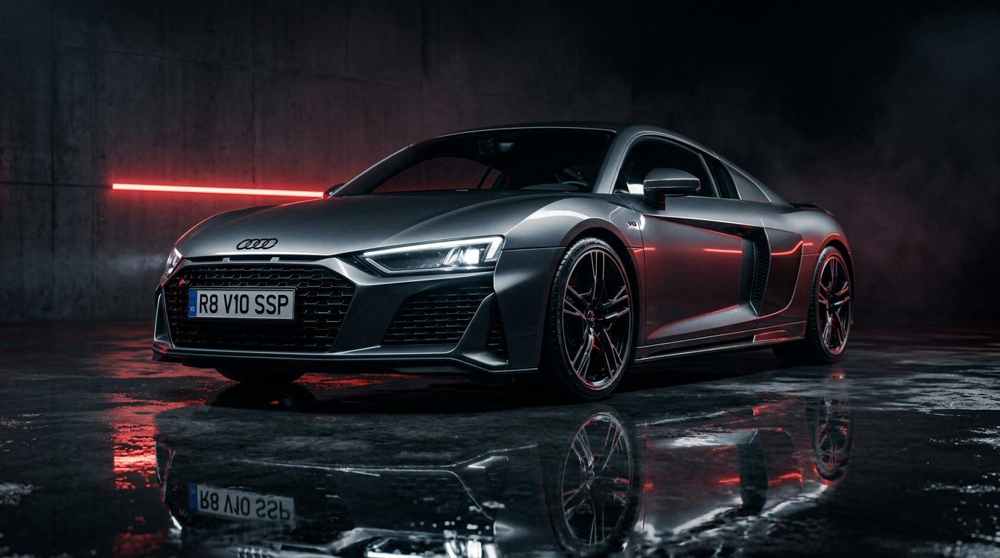
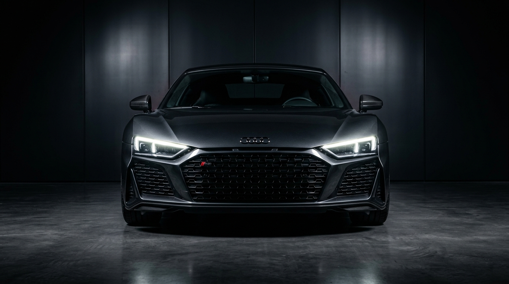
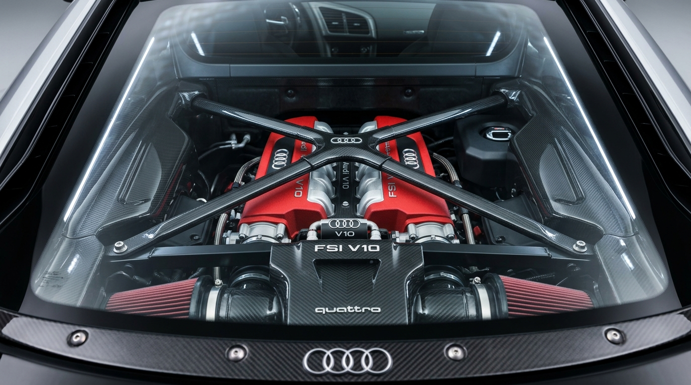
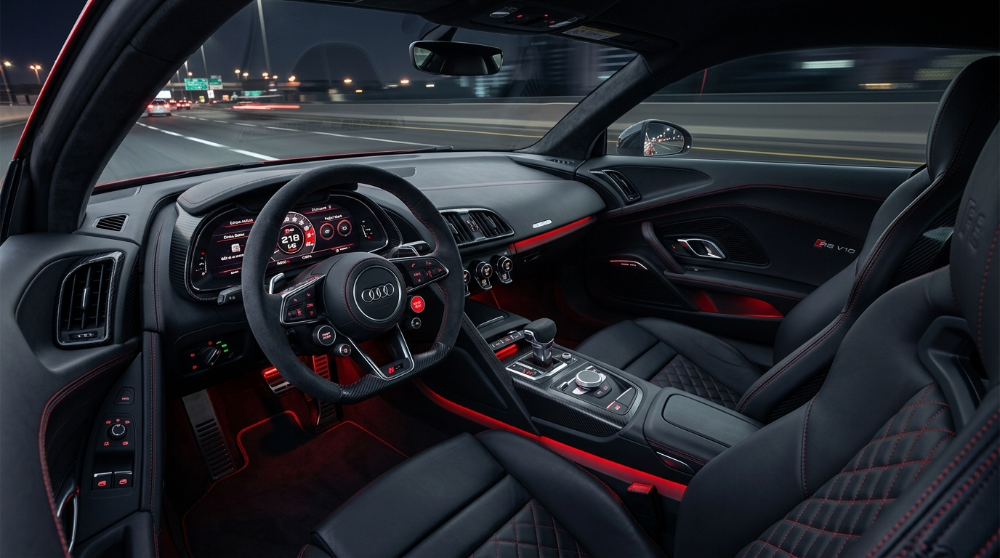
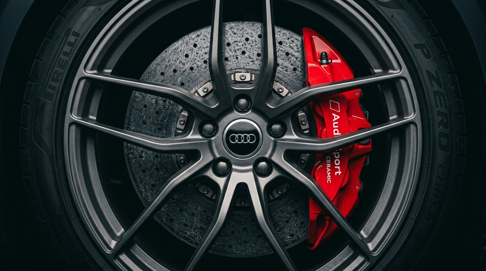

<div align="center">

# 🏎️ Audi R8 Super Sport V10
### Technical & Architectural Documentation

An ultra-modern, cinematic, interactive single-page digital showroom web application engineered for the launch of the **Audi R8 Super Sport V10 supercar**. Built using pure, standard web technologies (**HTML5, CSS3, Vanilla JavaScript, GSAP, ScrollTrigger, Lenis Smooth Scroll, and Web Audio API**).

[](https://developer.mozilla.org/en-US/docs/Web/HTML)
[](https://developer.mozilla.org/en-US/docs/Web/CSS)
[](https://developer.mozilla.org/en-US/docs/Web/JavaScript)
[](https://greensock.com/gsap/)
[](https://lenis.darkroom.engineering/)
[](https://developer.mozilla.org/en-US/docs/Web/API/Web_Audio_API)

<br />



</div>

---

## 📋 Table of Contents
- [✨ Key Features](#-key-features)
- [📸 Visual Showcase](#-visual-showcase)
- [⚡ Performance Benchmarks](#-performance-benchmarks)
- [🎨 UI/UX Design System](#-uiux-design-system)
- [🏗️ Website Architecture](#️-website-architecture)
- [🛠️ Technologies Used](#️-technologies-used)
- [📁 Directory Structure](#-directory-structure)
- [🚀 Quick Start & Setup](#-quick-start--setup)
- [📄 License & Credits](#-license--credits)

---

## ✨ Key Features

- 🔊 **Offline Web Audio API V10 Engine Synthesizer**: Generates real-time, multi-stage engine sounds in-browser (ignition pops, 4,500 RPM throttle sweeps, and 600 RPM idle rumbles) with zero external `.mp3` dependencies.
- 🧩 **Exploded 3D Engine Scroll Animation**: Scroll-triggered GSAP timeline that dynamically separates the 5.2L V10 engine into 5 distinct architectural layers on scroll down, and seamlessly reassembles on scroll up.
- 🔄 **360° Interactive Vehicle Inspector**: Touch and mouse-drag 360-degree exterior showcase with dynamic angle tracking and pulsing technical hotspots.
- 🎨 **Real-Time Car Configurator**: Interactive customizer allowing live switching of exterior paint finishes, forged wheels, carbon aero packages, and dynamic real-time price calculation.
- 💡 **Interactive Ambient Interior Lighting**: Monoposto cockpit viewer with live RGB LED mood lighting filter toggles (*Audi Red*, *Daytona Cyan*, *Kyalami Green*, *Vegas Gold*, *Pure White*).
- 📊 **Dynamic Telemetry & EMI Financial Calculator**: Interactive driving mode selector (*Track*, *Dynamic*, *Comfort*) and live monthly loan payment estimator.
- 🏎️ **Supercar Media Gallery & Lightbox**: Categorized masonry gallery with high-resolution lightbox modal inspection.

---

## 📸 Visual Showcase

| **Hero Showroom** | **5.2L V10 Engine** |
| :---: | :---: |
|  |  |

| **Cockpit & Ambient Interior** | **Performance & Aerodynamics** |
| :---: | :---: |
|  |  |

---

## ⚡ Performance Benchmarks

- ⚡ **120 FPS Ultra-Fluid Rendering**: Hardware-accelerated GPU transforms (`transform: translateZ(0)`), backface isolation, and composite-only layer optimization.
- 📜 **Stutter-Free Scroll Engine**: **Lenis Smooth Scroll** bound to GSAP ticker (`gsap.ticker.lagSmoothing(0)`), completely eliminating layout thrashing.
- 🖱️ **Uncompromised System Cursor**: Standard desktop cursor remains 100% visible and functional (`body { cursor: auto !important; }`) across all viewport sizes.
- 📱 **Mobile & High-DPI Responsive**: Fully fluid layout adaptively tested across mobile (375px+), tablet (768px), laptop (1024px), and 4K displays (1440px+).

---

## 🎨 UI/UX Design System

The application employs a **Dark Luxury Automotive & Liquid Glassmorphic** aesthetic inspired by modern supercar cockpits.

### Color Palette & Design Tokens

| Token / Layer | Color Code | Visual Representation / Usage |
| :--- | :--- | :--- |
| **Obsidian Backdrop** | `#050505` | Deep dark high-contrast background |
| **Audi Sport Red** | `#E30613` | Primary brand accent, glowing CTAs, progress fills |
| **Crimson Ambient Glow** | `#FF2A38` | Interactive drop shadow highlights |
| **Daytona Cyan** | `#00F0FF` | Engine telemetry & diagnostic badges |
| **Surface Glass Cards** | `rgba(255, 255, 255, 0.04)` | Translucent backdrop blur cards with rim borders |

### Typography Hierarchy

- **Headings**: `Space Grotesk`, sans-serif — Bold, geometric automotive typography.
- **Telemetry & Gauges**: `Orbitron`, sans-serif — Digital instrument cluster display font.
- **Body & Controls**: `Inter`, sans-serif — Clean, highly readable interface text.

---

## 🏗️ Website Architecture

The document is organized into **13 semantic sections**:

1. ⏱️ **Preloader & Audio Initializer**: 4-rings SVG line draw + digital 0-100% loading progress + audio engine unlock.
2. 🧭 **Navigation Bar**: Glassmorphic header with logo, smooth anchor navigation, sound toggle, and instant configuration CTA.
3. 🏎️ **Hero Section**: High-impact 4K vehicle hero visual, metallic typography, and live telemetry card.
4. 📈 **Vehicle Overview**: Asymmetric layout featuring animated GSAP count-up stats for horsepower, torque, top speed, and acceleration.
5. 🧩 **V10 Engine Disassembly**: ScrollTrigger-driven exploded view separating carbon brace, intake plenum, cylinder heads, engine block, and exhaust.
6. 🔄 **360° Exterior Inspector**: Mouse and touch-swipe multi-angle rotator with interactive hotspot telemetry.
7. ⚡ **Performance Telemetry**: Dynamic driving mode selector (*Dynamic*, *Track*, *Comfort*) altering live gauge telemetry.
8. 🛋️ **Monoposto Cockpit & Ambient LED**: Cockpit feature preview with interactive interior LED color selector.
9. 🖼️ **Supercar Media Gallery**: Filterable masonry grid with full-screen lightbox modal viewer.
10. 🛡️ **Advanced Technology Grid**: Feature cards for Audi Laser Matrix LED, Quattro AWD, and Bang & Olufsen 3D Sound.
11. 📋 **Technical Specifications**: Detailed comparison matrix between Super Sport V10 and standard V10 Coupe models.
12. 🔊 **V10 Soundboard**: Interactive audio triggers for Idle Rumble, High RPM Sweep, and Launch Control ignition.
13. 🛠️ **Car Configurator & EMI Calculator**: Real-time paint, wheel, and aero package customizer + financial monthly loan calculator.

---

## 🛠️ Technologies Used

- **HTML5**: Semantic markup, ARIA accessibility attributes, OpenGraph & Twitter card metadata.
- **CSS3**: CSS Custom Properties (Variables), Flexbox, CSS Grid, custom keyframes, backdrop-filter glassmorphism.
- **Vanilla JavaScript (ES6+)**: Modular application architecture, DOM event delegation, dynamic price & EMI math models.
- **GSAP 3.x**: High-performance timelines, ScrollTrigger pin/unpin animations, count-up number interpolation.
- **Lenis Scroll**: Smooth scroll momentum physics synchronized with GSAP frame ticker.
- **Web Audio API**: Real-time dual-oscillator sound synthesis, gain envelopes, low-pass filter sweeps, and noise generators.
- **FontAwesome 6**: High-resolution vector icon suite.
- **Google Fonts**: `Space Grotesk`, `Orbitron`, and `Inter`.

---

## 📁 Directory Structure

```
d/
├── index.html          # Semantic HTML5 document (13 interactive sections)
├── style.css           # Pure CSS3 design system, glassmorphism & responsive rules
├── script.js           # Vanilla JS app logic, Lenis scroll, GSAP & Web Audio synth
├── README.md           # Project documentation and architectural overview
└── assets/
    └── images/         # High-resolution 4K Audi R8 supercar photography
        ├── audi-r8-hero.jpg
        ├── audi-r8-front.jpg
        ├── audi-r8-side.jpg
        ├── audi-r8-back.jpg
        ├── engine.jpg
        ├── interior.jpg
        ├── wheel.jpg
        ├── carbon.jpg
        ├── dashboard.jpg
        ├── brake.jpg
        └── road.jpg
```

---

## 🚀 Quick Start & Setup

No complex build steps or node modules required! 

### Option 1: Direct Browser Launch
Simply double-click `index.html` or open it directly in any modern browser (Chrome, Edge, Firefox, Safari).

### Option 2: Local HTTP Server (Python)
To serve via a local server:

```bash
# Start a local HTTP server on port 8000
python -m http.server 8000 --bind 127.0.0.1
```

Then open `http://127.0.0.1:8000` in your web browser.

---

## 📄 License & Credits

Designed & Engineered for **Audi R8 Super Sport V10**. All rights reserved.